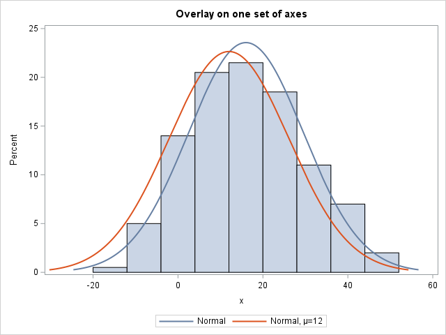

# SAS Examples for Plotting Multiple Distributions

The examples provided here show multiple ways to display multiple distributions on the same plot. Code for each example is provided. Each file is self-contained in that it provides the data and code needed to generate the full example without additional input.

> These examples were taken from SAS Documentation at: https://support.sas.com/kb/24/299.html . Please see the link for more information. 

## Part 1: Fitting separate distributions for each of several variables or BY groups

In PROC UNIVARIATE the method for fitting multiple distributions from the same theoretical family to each of multiple variables or BY groups is to generate multiple comparative plots in a one-way or two-way layout.

### Comparative plots using PROC UNIVARIATE

You can use the SAS procedure `proc univariate` along with the CLASS plotting statement to compare two distributions "side-by-side". The axes are automatically scaled to be the same across all plots.

> [code](code/proc_univariate_example.sas)

### Overlaid Plots using PROC SGPLOT

The SAS procedure `proc sgplot` is a very flexible plotting object. Overlaid plots can be generated using `proc sgplot` by using two separate variables, as opposed to a group as in the previous example. 

> [code](code/proc_sgplot_overlaid.sas)

### Grouped Histograms using PROC GCHART

Grouped histograms can be created using the SAS procedure `proc gchart`. Note that no distribution options are available for this procedure. 

> [code](code/prog_gchart_example.sas)

### Overlaid Plots using PROC GREPLAY

The SAS procedure `proc greplay` can be used to plot on the same graph by running two plots separately and then storing them in a graphics catalog. Then they can be "replayed" into the same template.

> [code](code/proc_greplay_overlaid_example.sas)

## Part 2: Fitting multiple distributions to a single variable

In PROC UNIVARIATE you can specify more than one distribution option in any plotting statement, but the distributions must be from different families. That is, you can plot both a normal curve and a lognormal curve on the same graph, but you cannot plot two different normal curves. To display multiple curves from the same family using these procedures, you can again use PROC GREPLAY to produce an overlay effect by replaying multiple graphs in the same template. There is also the ability to plot multiple distributions from the same family on one graph using PROC SGPLOT. Side-by-side histograms that use the same axes are available in PROC GCHART, but there are no options for displaying theoretical distributions.

### Overlaid Plots using PROC SGPLOT

With `PROC SGPLOT`, you can specify multiple HISTOGRAM and DENSITY statements to create overlay plots.

> [code](code/proc_sgplot_multi_overlaid.sas)

### Overlaid Plots using PROC GREPLAY

Run the plots separately and store them in a graphics catalog. ODS Graphics must be disabled. Use AXIS options if necessary to ensure the same scaling on each plot. You can use the NODISPLAY option in a GOPTIONS statement to suppress the individual histograms from being displayed. The DISPLAY graphics option prior to PROC GREPLAY displays only the template of graphs.

> [code](code/proc_greplay_multi_overlaid_example.sas)

## Info

source: https://support.sas.com/kb/24/299.html
author:
        Sean T Ford
        sean.ford@sas.com
date: 5/3/2023

               

